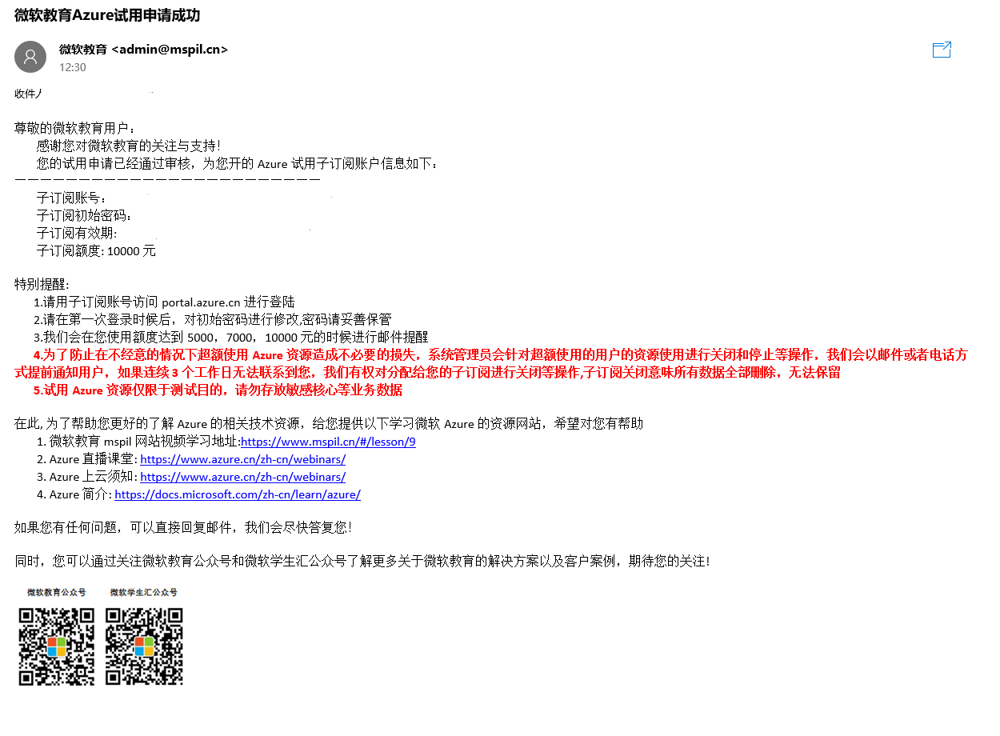
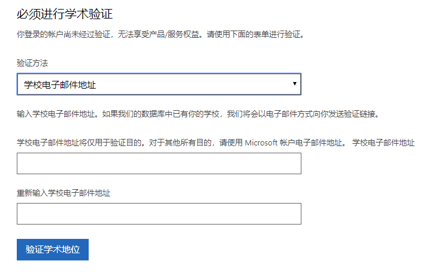
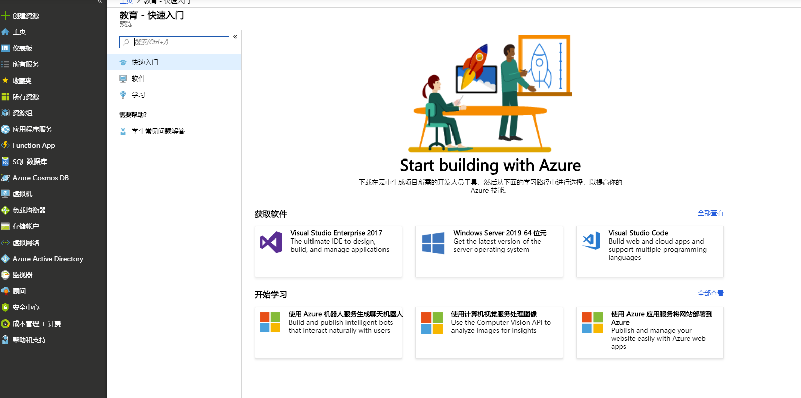

# 这是常用问题集锦

- [azure](#Q-11)

1. 安装深度学习环境的电脑需要什么型号的GPU？

    目前来说，Nvidia的支持CUDA的GPU应当都是可以的，具体型号可以查阅[CUDA支持列表](https://developer.nvidia.com/cuda-gpus)

2. 安装Visual Studio时默认安装了Python，还需要额外安装Python吗？

    不需要，如果有额外的需求，将Visual Studio所安装的python添加到系统路径即可。
    Visual Studio自带python的安装路径一般为:`\Microsoft Visual Studio\Shared\Python36_64`，具体路径请根据具体机器确定

3. 安装环境时，64位的机器被检测成为32位的机器，怎么处理？

    检查python的安装版本，如果是32位的python请重新安装

4. 安装Visual Studio时报错 `Visual Studio Integration 失败`

    暂时先选择少一些的组件进行安装，比方说只选择python模块

5. 运行代码时显示显存不够(e.g. `OOM when allocating tensor with shape[10000,32,28,28] and type float`)，怎么处理？

    将训练数据的batch size减小即可

6. 运行install.py中途报错或者提示手动安装怎么处理？

    可能是网络问题等。可以考虑重新运行install.py或者使用pip命令去安装所缺失的模块，如不停失败可以修改pip所对应的镜像源。

7. 学习人工智能需要什么样的数学基础？

    从入门来说，只需要线性代数和求导两个部分即可，通过自己推导并仿写代码，可以比较快速的入门

8. 在案例中都是使用C#来写的，可以采用其他语言吗？

   认知服务提供多种语言对应的接口，完全可以使用Python等支持的语言来进行使用

9. 为什么深度学习模型计算公式是那样？是由专家们先设计出一些固定模型后，然后我们来学习这些模型的应用么？

    是由生物学家，数学家和计算机科学家等等通过对人类智能的研究，得到抽象的模型，并根据模型设计出来的算法公式。

10. 想要深入了解深度学习，除了这份教程外，还有哪些参考书或者网络课程可以看呢？

    有很多，比如Ian Goodfellow、Yoshua Bengio和Aaron Courville的深度学习，Andrew Ng的相关课程等等。

11. 如何申请Azure的学生账号？

    1. 使用世纪互联中国版：
        1. 打开[https://mspil.cn](https://mspil.cn)并注册账户，验证学生身份，具体申请流程参考下图

        

        2. 完成申请流程后，会收到如下邮件：

        

        3. 利用子账户和对应密码登录[portal.azure.cn](https://portal.azure.cn)，并创建所需资源
    
    2. 使用全球版：
        1. 登录[Azure 全球版学生入口](https://azure.microsoft.com/zh-cn/free/students/)，点击立即激活

        

        2. 登录已有微软账号或重新注册微软账号

        3. 输入学校电子邮箱地址进行验证，如未出现此网页，可重新访问[Azure 全球版学生入口](https://azure.microsoft.com/zh-cn/free/students/)，并点击激活。

        

        4. 验证成功后即可进入以下界面，按需求创建虚拟机即可（若未进入该界面，可点击该[链接](https://portal.azure.com/)）

        
